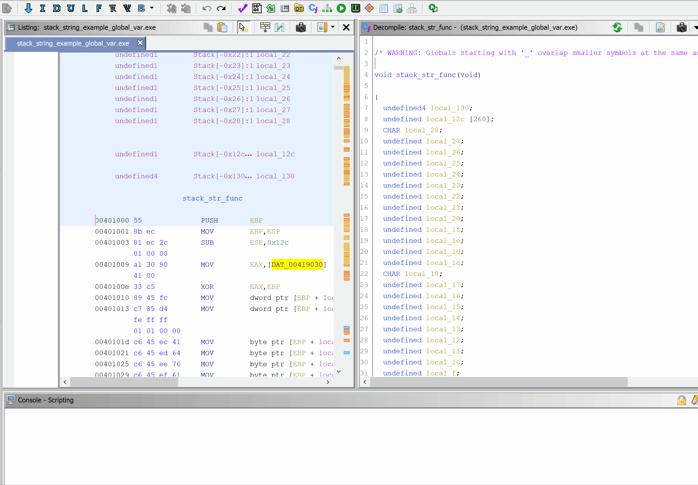

# ghidra-scripts
This repo will be used to store the Ghidra scripts that I have written.

## Installation
Copy the script files into any of `ghidra_scripts` directories (which can be found under `Window->Script Manager->Script Directories`).

## StackStringsDynamicAPILoading.py
Python script with the following objectives:
- Find stack strings within a function, relabel them, and retype them as correctly sized character arrays
- Rename and retype dynamically loaded Windows APIs

This script can be called in two ways:
- Current function (only run within the function that the user is currently in)
- All functions

Different stack string examples (written in C) can be found in `examples/StackStringsDynamicAPILoading`.
